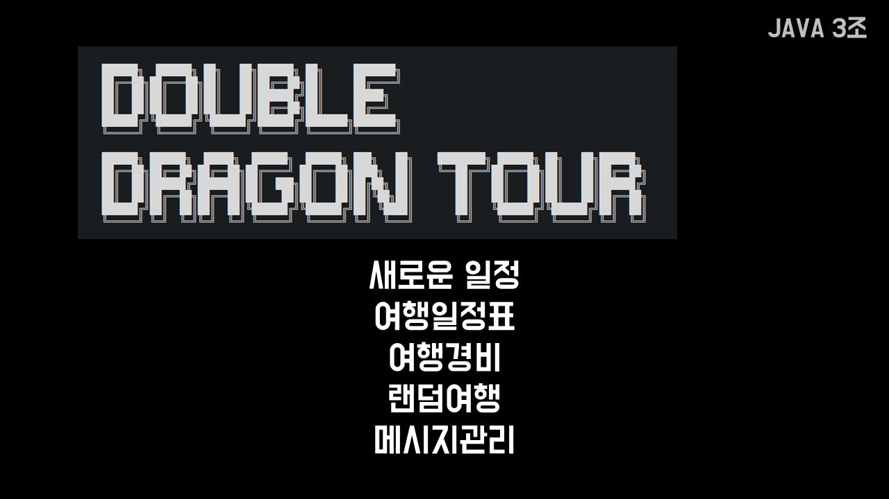
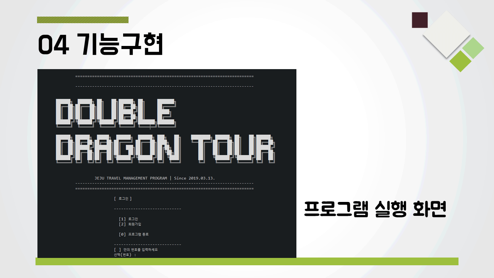
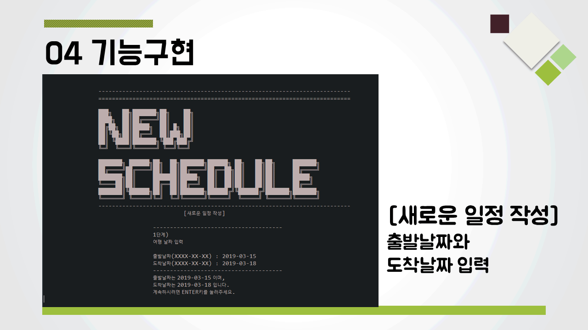
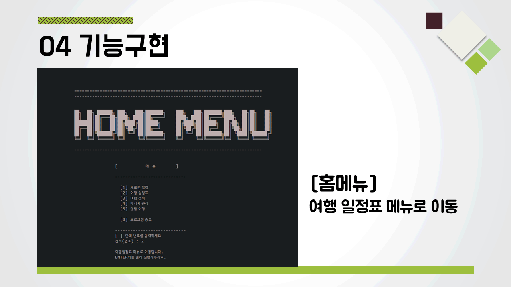
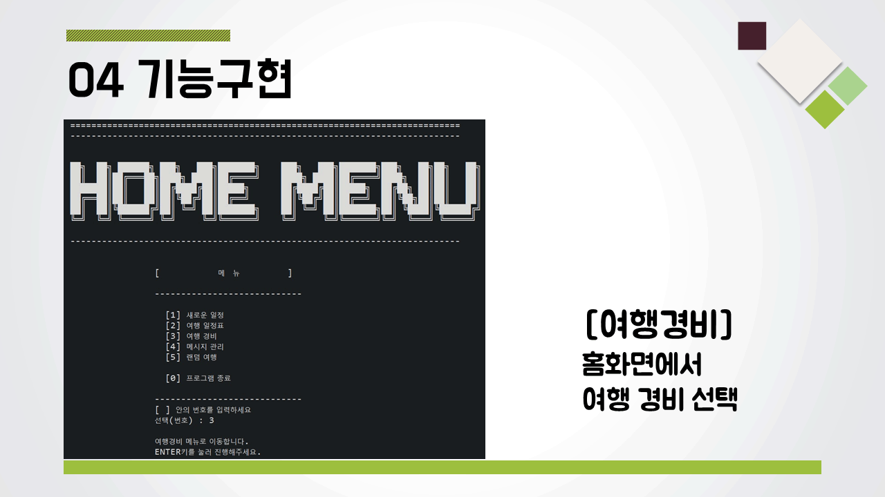
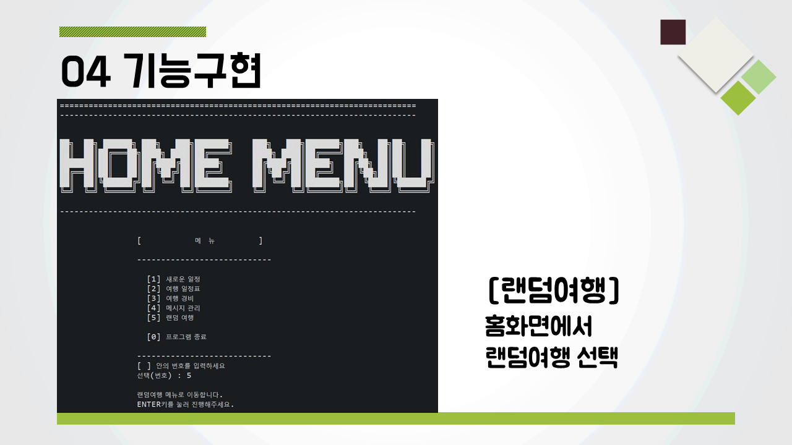
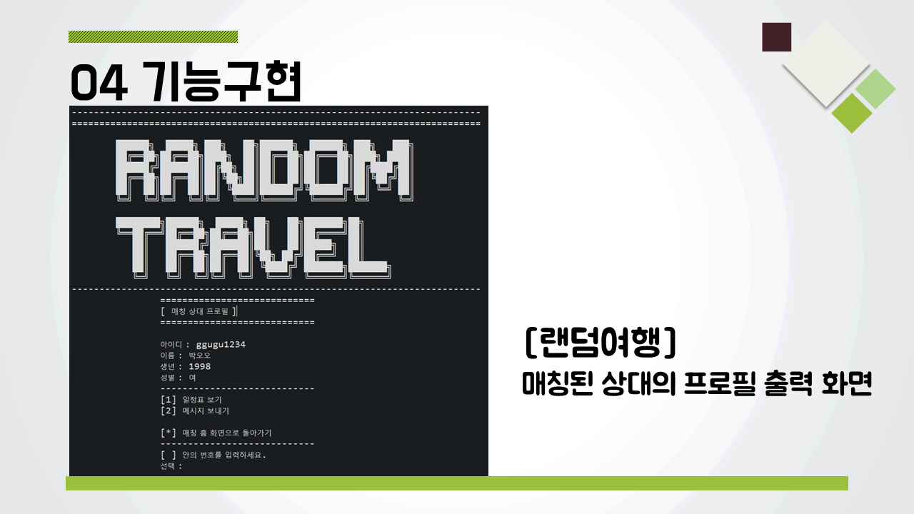

# Jeju Double Dragon Tour

### 👋 Introduction

<table>
    <tr>
        <th>프로젝트명</th>
        <th>Jeju Double Dragon Tour</th>
        <th>개발 기간</th>
        <th>2019.03.06. ~ 2019.03.15.  (일 4시간, 총 9일)</th>
    </tr>
    <tr>
        <th>프로젝트 성격</th>
        <th>세미 프로젝트</th>
        <th>개발 인원</th>
        <th>팀 / 6명 
          (<a href="https://github.com/chanmi-kim">KCM</a>,
          <a href="https://github.com/mygom1171">UHC</a>,
          <a href="https://github.com/heejeen">JHJ</a>,
          <a href="https://github.com/kdsss123">KDS</a>,
          <a href="https://github.com/junwoooo123">PJW</a>,
          <a href="https://github.com/grills14">KBJ</a>)
      </th>
    </tr>
      <tr>
        <th>프로젝트 개요</th>
        <th>제주 랜덤매칭여행 일정관리 프로그램</th>
        <th>개발 환경</th>
        <th>Windows 10, Eclipse JEE, Java(JDK1.8)</th>
    </tr>
        <tr>
        <th>주요 기술</th>
        <th>Java</th>
        <th>비고</th>
        <th> </th>
    </tr>
</table>

### 📼 Appearance

자바 컬렉션과 파일 입출력을 이용한 제주 랜덤매칭여행 일정관리 프로그램입니다.

<table>
    <tr>
        <th colspan="3">Task</th>
    </tr>
    <tr>
        <th colspan="3"></th>
    </tr>
    <tr>
       <th>Sign Up & In</th>
       <th>New Schedule</th>
       <th>View Schedules</th>
    </tr>
    <tr>
        <th></th>
        <th></th>
        <th></th>
    </tr>
      <tr>
       <th>Travel Cost</th>
       <th>Random Travel</th>
       <th>Message</th>
    </tr>
    <tr>
        <th></th>
        <th></th>
        <th></th>
    </tr>
</table>

### 📑 Role & Member

<table>
    <tr>
        <th>업무/구성원</th>
        <th><a href="https://github.com/chanmi-kim">KCM</a></th>
        <th><a href="https://github.com/mygom1171">UHC</a></th>
        <th><a href="https://github.com/heejeen">JHJ</a></th>
        <th><a href="https://github.com/kdsss123">KDS</a></th>
        <th><a href="https://github.com/junwoooo123">PJW</a></th>
        <th><a href="https://github.com/grills14">KBJ</a></th>
    </tr>
    <tr>
        <th>프로젝트 기획</th>
        <th colspan="6">아이디어 회의, 의견제안</th>
    </tr>
    <tr>
        <th>요구분석</th>
        <th colspan="6">아이디어 회의, 의견제안, 문서작성</th>
    </tr>
    <tr>
        <th>데이터설계</th>
        <th colspan="3">아이디어 회의, 의견제안</th>
        <th colspan="2">파일생성</th>
        <th>의견제안</th>
    </tr>
    <tr>
        <th>기능명세서</th>
        <th colspan="2">문서작성</th>
        <th>문서취합</th>
        <th colspan="3">문서작성</th>
    </tr>
    <tr>
        <th>화면설계</th>
        <th colspan="6">회의 및 의견제안, 화면설계 작성</th>
    </tr>
    <tr>
        <th>소스(코딩)</th>
        <th>여행일정표  개발</th>
        <th>새로운 일정표 개발,  버그 수정</th>
        <th>랜덤여행  개발</th>
        <th>여행경비,  회원가입  개발,  더미 생성</th>
        <th>여행경비,  로그인 개발,  더미 생성</th>
        <th>메시지관리  개발</th>
    </tr>
    <tr>
        <th>발표자료</th>
        <th>빌표,  자료작성</th>
        <th>발표보조</th>
        <th colspan="4">의견제안</th>
    </tr>
    <tr>
        <th>역할</th>
        <th>의견제안,  문서개요작성,  화면설계,  DB설계,  소스취합,  발표</th>
        <th>의견제안,  화면설계,  버그수정,  발표보조</th>
        <th>의견제안,  화면설계,  문서취합,  문서작업</th>
        <th>의견제안,  화면설계,  데이터 관리</th>
        <th>의견제안,  화면설계,  데이터 관리</th>
        <th>의견제안,  화면설계,  문서작업</th>
    </tr>
</table>
